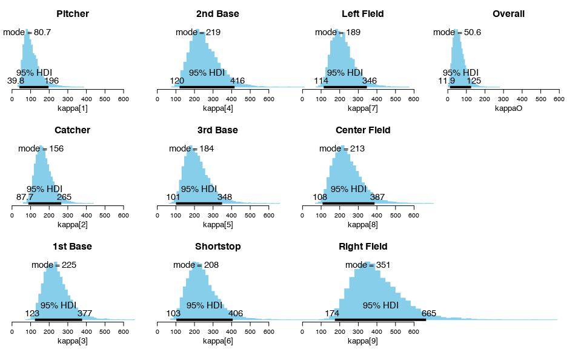
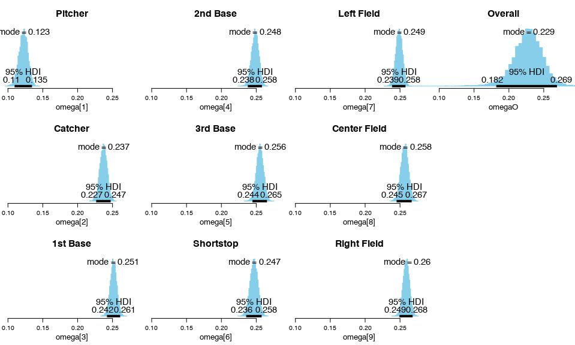
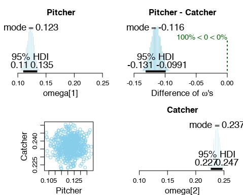
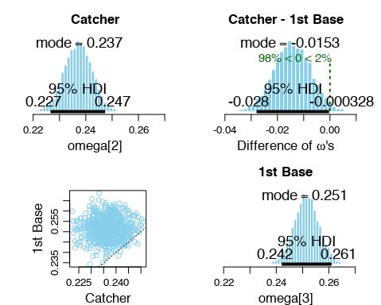
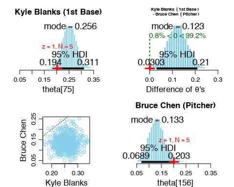
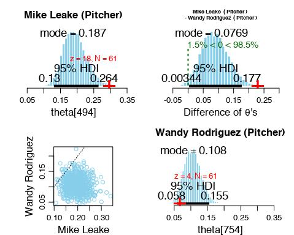
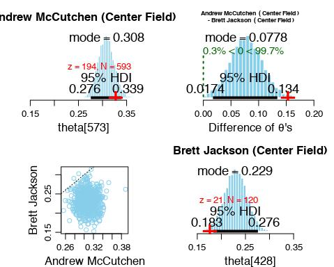
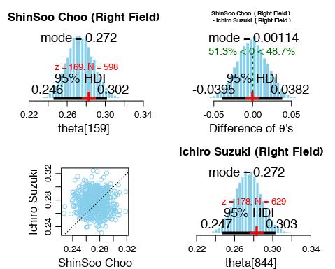

# Modeling Baseball Batting Abilities by Position

This is an example from Kruschke(2015)[^1], section 9.5.1. A generic description of the model and the model's specification in JAGS can be found in section 9.5.

```{r message=FALSE}
library(nimble)
library(dplyr)
library(knitr)
source("plotMCMC.R")
source("DBDA2E-utilities.R")
```

```{r}
knitr::opts_chunk$set(eval = FALSE)
```

### Background

In a baseball game, each player have some number of opportunities to hit the ball (or opportunities at bat). Given each opportunity, the player may or may not hit the ball. The batting average (hits divided by opportunities at bat) of the players can be indicative of their batting abilities. Different players, however, have different primary positions. For example, some perform the pitcher position the most often, and are therefore not expected to focus on hitting skills. The hierarchical model in this example groups players by their primary positions, so that one can not only estimate the batting average of each player, but also the batting average of different positions, as well as the overall batting ability of the players.

The following data[^2] were given. The column `PriPos` contains the primary positions of the players. `Hits` and `AtBats` are the number of hits and the number of opportunities at bat. `PlayerNumber` and `PriPosNumber` are numeric identifiers of the first two columns respectively.

```{r}
data <- read.csv('BattingAverage.csv')
data
```

### The Model 

The data is modeled with a hierarchical model. Suppose there are $s$ players and the underlying probability that each player will hit the ball given an opportunity at bat is $\theta_i$, where $i=1,2,...,s$. Thus, the number of `Hits` of the $i$th player is modeled with a binomial(`AtBats`, $\theta_i$) distribution. 

Each player has one of the 9 primary positions. The batting probabilities ($\theta_i$'s) of the players that have different primary positions are assumed to be draws from beta distributions with different parameters. More specifically, for $c=1,2,...,9$, the batting probabilities of the players in the $c$th primary position follows beta$(\omega_c(\kappa_c-2)+1,~ (1-\omega_c)(\kappa_c-2)+1)$, where $c$ stands for category. $\omega_1$ models the mode of the batting probabilities of players who have primary position #1, while $\kappa_1$ quantifies the certainty regarding the dependence of those batting probabilities on $\omega_1$. For simplicity, the $kappa_c$'s are given a common prior.

The $\omega_c$'s (the estimators of the group batting abilities) are assumed to be draws from a beta$(\omega(\kappa-2)+1,~ (1-\omega)(\kappa-2)+1)$ distribution. $\omega$, the mode of this distribution, is an indicator of the overall batting abilities of all groups of players, while $\kappa$ represents the variability of the batting abilities across groups. Priors of $\omega$ and $\kappa$ are chosen to be generic beta and gamma distributions respectively.

```{r}

batCode <- nimbleCode({
  omegaO ~ dbeta(1, 1)
  kappaMinusTwoO ~ dgamma(0.01, 0.01)
  kappaO <- kappaMinusTwoO + 2 
  for (c in 1:nCat) {
    omega[c] ~ dbeta(omegaO*(kappaO-2)+1, (1-omegaO)*(kappaO-2)+1 )
    kappaMinusTwo[c] ~ dgamma(0.01, 0.01)
    kappa[c] <- kappaMinusTwo[c] + 2
  }
  for (s in 1:nSubj) {
    theta[s] ~ dbeta(omega[cat[s]]*(kappa[cat[s]]-2)+1,
                     (1-omega[cat[s]])*(kappa[cat[s]]-2)+1)
    z[s] ~ dbinom(size = n[s], prob = theta[s])
  }
})

nCat <- length(unique(data$PriPos))
nSubj <- length(unique(data$Player))
z <- data$Hits
n <- data$AtBats
## initial values of theta's
thetaInits <- rep(NA, nSubj)
for (s in 1:nSubj) {
  resampledZ <- rbinom(n = 1, size = n[s], prob = z[s]/n[s]) 
  thetaInits[s] <- resampledZ/n[s]
}
thetaInits <- 0.001 + 0.998 * thetaInits
## initial values of omega's
omegaInits <- aggregate(thetaInits, by=list(data$PriPosNumber), FUN=mean)$x 
omegaInitsO <- mean(thetaInits)
kappaInits <- rep(100, nCat)
kappaInitO <- 100

## data
batData <- list(z = z, n = n)

## constants of the model 
batConsts <- list(subjects = data$Player, cat = data$PriPosNumber, nCat = nCat, nSubj = nSubj)

## values to initialize the algorithm
batInits <- list(theta = thetaInits, omega = omegaInits, omegaO = omegaInitsO,
              kappaMinusTwo = kappaInits - 2, kappaMinusTwoO = kappaInitO - 2)

```

```{r}

## 1) let's use samplesAsCodaMCMC so we don't have to convert anymore objects
## 2) let's use multiple chains (so we replicating as much as we can)
## Krutsche uses 4 chains by default unless stated in the coe 
## 3) ignore adatpsteps
## 4) see MCMC_settings_Kruschke_NIMBLE.R for info on conversion of parameter  

nchains <- 4
nburnin <- 500 ## it can be the same as in Kruschke
niter <- 13750 + nburnin  
## ceiling(numSavedSteps*thinSteps/nChains) (from Kruschke) plus NIMBLE comprises the burnin
thin <- 20/nchains ## divide Kruschke setting by nchains

mcmcCoda <- nimbleMCMC(code = batCode, constants = batConsts,
						data = batData, inits = batInits,
						niter = niter, nburnin = nburnin, 
						thin = thin, nchains = nchains,
            monitors = c("theta","omega","kappa","omegaO","kappaO"), 
						samplesAsCodaMCMC = TRUE)
```

```{r}
## prepare plotting
tbl <- unique(data[, c('PriPos', 'PriPosNumber')])
tblAsc <- arrange(tbl, PriPosNumber)
tblAsc[['PriPos']] <- as.character(tblAsc[['PriPos']])
mainLab <- c(tblAsc$PriPos, "Overall")
data[['PriPosNumber']] <- as.factor(data[['PriPosNumber']])

plotMCMC( mcmcCoda , data=data , 
          zName="Hits", NName="AtBats", sName="Player", cName="PriPosNumber",
          compVal=NULL ,
          diffCList=list( c(1, 2) ,    ## 1=Pitcher, 2=Catcher  ## check tbl for more
                          c(2, 3) ) ,  ## 2=Catcher, 3=1st Base
          diffSList=list( c("Kyle Blanks","Bruce Chen") , 
                          c("Mike Leake","Wandy Rodriguez") , 
                          c("Andrew McCutchen","Brett Jackson") , 
                          c("ShinSoo Choo","Ichiro Suzuki") ) , 
          compValDiff=0.0, 
          saveName="Batting_Average_" , saveType="jpg")
```










### A Generalization of the Model

In general, the model can be applied in situations where the subjects are associated with dichotomous ($0$ vs $1$ / failure vs success) data values and the subjects are in one of many categories. Each "trial" of a subject is assumed to be a draw from a Bernoulli$(\theta)$ distribution, where the parameter $\theta$ depends on the category the subject is in. 

Suppose there are $s$ subjects and $c$ categories in total. Let $\theta_1, ...,\theta_s$ be the probability of success of subject 1, subject 2, ..., subject $s$, respectively. Those probabilities ($\theta$'s) of the subjects that belong to the same category, in turn, is assumed to come from a beta$(\omega_c(\kappa_c-2)+1,~ (1-\omega_c)(\kappa_c-2)+1)$ distribution. For example, the mode of the distribution of $\theta$'s in the first category is modeled with $\omega_1$, while $\kappa_1$ quantifies the certainty regarding the dependence of those $\theta$'s on $\omega_1$. 

To model the relationship between the overall probability of "success" and the probability of "success" of the different categories, the $\omega_i$'s are assumed to be draws from a higher-level distribution, which, in this model, is beta$(\omega(\kappa-2)+1,~ (1-\omega)(\kappa-2)+1)$. The central tendency, $\omega$, and the scale, $\kappa$, follow given prior distributions. For simplicity, the $\kappa_i$'s are assumed not to inform each other via interactions with a higher-level distribution, and are therefore given the same prior distribution in this example.

[^1]: Kruschke, J.K.,2015. Doing Bayesian data analysis: a tutorial with R, JAGS, and stan. 2E [edition]. Academic Press.
[^2]: Data retrieved 22 December 2012 from http://www.baseball-reference.com/leagues/MLB/2012-standard-batting.shtml